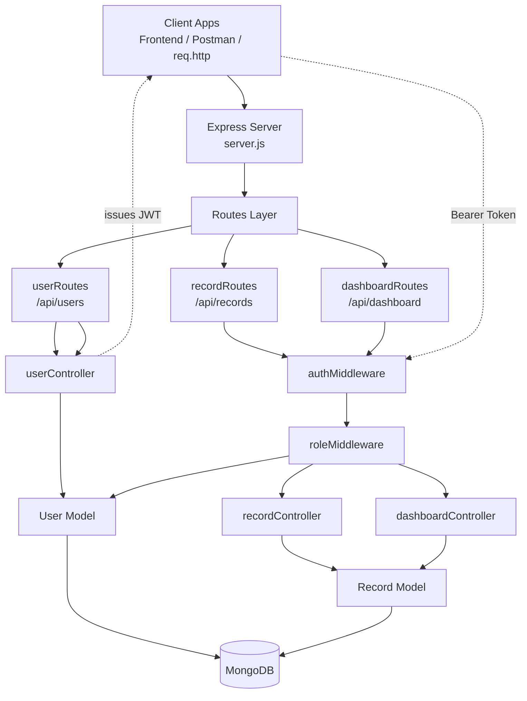

# Finance Backend

Backend API for a finance tracking application built with Node.js, Express, MongoDB, and JWT authentication.

## Tech Stack

- Node.js
- Express
- MongoDB with Mongoose
- JWT for authentication
- bcryptjs for password hashing

## Features

- User registration and login
- Role-based access control (`viewer`, `analyst`, `admin`)
- Record management for income and expense entries
- Dashboard summary APIs for totals and category breakdowns
- Soft delete support for records

## Project Structure

```text
finance-backend/
|-- config/
|-- controllers/
|-- middleware/
|-- models/
|-- routes/
|-- req.http
|-- server.js
`-- .env
```

## Architecture Diagram



Brief flow:

- Client requests enter `server.js`, which mounts the route modules.
- Public user routes go directly to `userController`.
- Protected record and dashboard routes pass through `authMiddleware` first.
- Role-based checks happen in `roleMiddleware` before hitting protected controllers.
- Controllers use Mongoose models to read and write data in MongoDB.
- Login returns a JWT token that clients send back in the `Authorization` header.

## Environment Variables

Create a `.env` file with:

```env
PORT=5000
MONGO_URI=your_mongodb_connection_string
JWT_SECRET=your_jwt_secret
```

## Installation

```bash
npm install
```

## Run The Server

Development:

```bash
npm run dev
```

Production:

```bash
npm start
```

Base URL:

```text
http://localhost:5000
```

## Authentication

- Protected routes expect `Authorization: Bearer <token>`.
- Tokens are issued from `POST /api/users/login`.
- The token payload contains the user id and role.
- Route access is controlled through `authMiddleware` and `authorizeRoles(...)`.

## Roles

- `viewer`: default user role when no role is provided at signup
- `analyst`: can access dashboard summary endpoints
- `admin`: can access dashboard endpoints and create/update/delete records

## API Routes

### Health Route

#### `GET /`

Brief: simple server health check.

Access: public

Response:

- Returns plain text: `Server is running`

---

### User Routes

Base path: `/api/users`

#### `GET /api/users`

Brief: fetches all users from the database.

Access: public

Request body: none

Query params: none

Response:

- `200 OK`
- Returns `message` and a `users` array

Notes:

- This route currently has no authentication middleware.
- Returned user documents include stored fields from the model.

#### `POST /api/users`

Brief: creates a new user account.

Access: public

Request body:

```json
{
  "name": "John Doe",
  "email": "john@example.com",
  "password": "password123",
  "role": "admin"
}
```

Required fields:

- `name`
- `email`
- `password`

Optional fields:

- `role` (`viewer`, `analyst`, or `admin`)

Behavior:

- Checks for missing required fields
- Rejects duplicate emails
- Hashes the password before saving
- Creates the user with default `status: active` when not supplied

Response:

- `201 Created` with `message` and created `user`
- `400 Bad Request` if required fields are missing or email already exists

#### `POST /api/users/login`

Brief: authenticates a user and returns a JWT token.

Access: public

Request body:

```json
{
  "email": "john@example.com",
  "password": "password123"
}
```

Behavior:

- Finds the user by email
- Compares the provided password with the hashed password
- Generates a JWT token valid for `1d`

Response:

- `200 OK` with `message` and `token`
- `400 Bad Request` for invalid credentials

---

### Record Routes

Base path: `/api/records`

#### `GET /api/records`

Brief: returns finance records with optional filtering and pagination.

Access: public

Query params:

- `user`: filter by user id
- `type`: filter by `income` or `expense`
- `category`: filter by category name
- `page`: page number, default `1`
- `limit`: number of records per page, default `5`

Behavior:

- Only returns records where `isDeleted` is `false`
- Populates the `user` field with `name` and `email`
- Applies pagination using `skip` and `limit`

Response:

- `200 OK` with `message`, `page`, `limit`, and `records`

Example:

```http
GET /api/records?page=1&limit=5&type=income
```

#### `POST /api/records`

Brief: creates a new finance record for the authenticated user.

Access: protected, `admin` only

Headers:

```http
Authorization: Bearer <jwt_token>
```

Request body:

```json
{
  "amount": 1000,
  "type": "income",
  "category": "salary",
  "date": "2024-01-01",
  "note": "Monthly salary"
}
```

Required fields:

- `amount`
- `type`
- `category`

Optional fields:

- `date`
- `note`

Behavior:

- Uses `req.user.id` from the token as the record owner
- Saves the record with `isDeleted: false` by default

Response:

- `201 Created` with `message` and created `record`
- `400 Bad Request` if required fields are missing
- `401 Unauthorized` if token is missing or invalid
- `403 Forbidden` if the authenticated user is not an admin

#### `PUT /api/records/:id`

Brief: updates an existing record by record id.

Access: protected, `admin` only

Headers:

```http
Authorization: Bearer <jwt_token>
```

Path params:

- `id`: MongoDB record id

Request body:

- Any record fields to update, such as `amount`, `type`, `category`, `date`, or `note`

Behavior:

- Updates the matching record and returns the new version

Response:

- `200 OK` with `message` and updated `record`
- `404 Not Found` if the record does not exist
- `401 Unauthorized` if token is missing or invalid
- `403 Forbidden` if the authenticated user is not an admin

#### `DELETE /api/records/:id`

Brief: soft deletes a record by setting `isDeleted` to `true`.

Access: protected, `admin` only

Headers:

```http
Authorization: Bearer <jwt_token>
```

Path params:

- `id`: MongoDB record id

Behavior:

- Does not remove the document permanently
- Marks the record as deleted so it is hidden from the list route

Response:

- `200 OK` with `message`
- `404 Not Found` if the record does not exist
- `401 Unauthorized` if token is missing or invalid
- `403 Forbidden` if the authenticated user is not an admin

---

### Dashboard Routes

Base path: `/api/dashboard`

#### `GET /api/dashboard/summary`

Brief: returns income, expense, and balance totals for records.

Access: protected, `admin` and `analyst`

Headers:

```http
Authorization: Bearer <jwt_token>
```

Query params:

- `user`: optional user id to restrict the summary to one user's records

Behavior:

- Aggregates records by `type`
- Computes total `income`
- Computes total `expense`
- Computes `balance = income - expense`

Response:

- `200 OK` with `message`, `income`, `expense`, and `balance`
- `401 Unauthorized` if token is missing or invalid
- `403 Forbidden` if the authenticated user is not `admin` or `analyst`

#### `GET /api/dashboard/categories`

Brief: returns category-wise aggregated totals across records.

Access: protected, `admin` and `analyst`

Headers:

```http
Authorization: Bearer <jwt_token>
```

Query params:

- `user`: optional user id to restrict aggregation to one user's records

Behavior:

- Aggregates records by `category`
- Returns total amount for each category

Response:

- `200 OK` with `message` and `categories`
- `401 Unauthorized` if token is missing or invalid
- `403 Forbidden` if the authenticated user is not `admin` or `analyst`

---

## Testing The API

The repository already includes [`req.http`](/d:/finance-backend/req.http), which contains ready-to-run HTTP requests for:

- user registration
- login
- record CRUD operations
- dashboard summary endpoints
- health check

## Current Behavior Notes

- `GET /api/users` is public.
- `GET /api/records` is also public, while create/update/delete are admin-only.
- Dashboard aggregations do not currently filter out soft-deleted records.
- Auth middleware logs the authorization header and auth errors to the console.

## Scripts

```json
{
  "start": "node server.js",
  "dev": "nodemon server.js"
}
```
