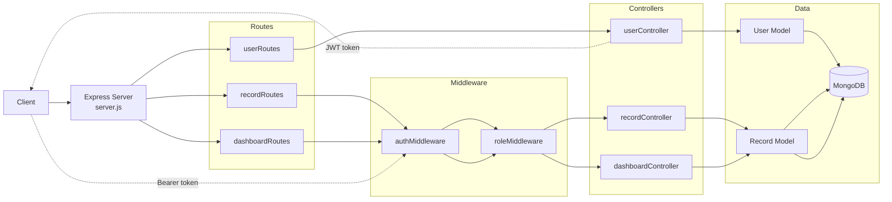

# Finance Backend - REST API for Personal Finance Tracking

Finance Backend is a RESTful API service that handles user authentication, role-based access control, financial record management, and dashboard analytics for a personal finance tracking application.

Instead of treating finance entries as raw data rows, this project organizes income and expense records into role-gated, queryable summaries that serve both individual users and admin dashboards.


## Overview

The API accepts standard HTTP requests, authenticates users with JWT, stores data in MongoDB using Mongoose, and exposes endpoints for record management and financial summaries.

Core outcomes:

- register and authenticate users securely
- enforce role-based access to protected routes
- create, update, and soft-delete financial records
- aggregate income, expense, and balance summaries
- break down spending by category

---

---

## Test Credentials

Use these credentials to test the API without manual registration:

| Role | Email | Password |
| --- | --- | --- |
| `admin` | admin@example.com | 123456 |
| `analyst` | analyst@example.com | 123456 |
| `viewer` | viewer@example.com | 123456 |

> These users can be seeded into MongoDB using the registration endpoint or a seed script. The admin token unlocks all record and dashboard routes.

---

## Architecture



---
## Key Features

- **JWT Authentication** – Users authenticate securely using email and password, receive a signed JWT token, and must include it as a Bearer token to access all protected API routes.

- **Role-Based Access Control** – Supports `viewer`, `analyst`, and `admin` roles with strict access enforcement using `authMiddleware` and `authorizeRoles(...)` to ensure each user only accesses permitted resources.

- **Record Management** – Admin users can create income and expense records, update existing entries, and perform soft-deletes by setting `isDeleted=true` instead of permanently removing data.

- **Paginated Record Listing** – Provides flexible record retrieval with filtering by user, type, and category, along with pagination support and configurable page size for efficient data handling.

- **Dashboard Summary** – Enables admins and analysts to retrieve aggregated financial insights including total income, total expenses, and net balance, with optional filtering by specific users.

- **Category Breakdown** – Offers detailed category-wise aggregation of financial data, allowing frontend applications to easily build charts and visualize spending patterns without extra processing.

- **Soft Delete Support** – Ensures records are never permanently deleted by using an `isDeleted` flag, helping maintain audit trails, data recovery, and consistent historical tracking.

## Tech Stack

| Layer | Technology |
| --- | --- |
| Runtime | Node.js |
| Framework | Express |
| Database | MongoDB |
| ODM | Mongoose |
| Authentication | JWT (`jsonwebtoken`) |
| Password Hashing | bcryptjs |
| Dev Server | nodemon |

---

## Authentication

- Protected routes expect `Authorization: Bearer <token>`.
- Tokens are issued from `POST /api/users/login`.
- The token payload contains the user id and role.
- Route access is controlled through `authMiddleware` and `authorizeRoles(...)`.

## Roles

- `viewer`: default user role when no role is provided at signup
- `analyst`: can access dashboard summary endpoints
- `admin`: can access dashboard endpoints and create, update, and delete records

---

## API Routes

### Health Route

| Method | Endpoint | Access | Description | Response |
|---|---|---|---|---|
| `GET` | `/` | Public | Server health check | Plain text: `Server is running` |

---

### User Routes

| Method | Endpoint | Access | Description | Success Response |
|---|---|---|---|---|
| `GET` | `/api/users` | Public | Fetch all users | `200` with `users` array |
| `POST` | `/api/users` | Public | Create a new user account | `201` with created `user` |
| `POST` | `/api/users/login` | Public | Login and receive JWT token | `200` with `token` |

**Request body details**

| Endpoint | Required Fields | Optional Fields | Notes |
|---|---|---|---|
| `POST /api/users` | `name`, `email`, `password` | `role` | Password is hashed before save; duplicate emails return `400` |
| `POST /api/users/login` | `email`, `password` | None | Returns JWT valid for `1d`; invalid credentials return `400` |

---

### Record Routes

| Method | Endpoint | Access | Role | Description | Success Response |
|---|---|---|---|---|---|
| `GET` | `/api/records` | Public | None | List records with filters and pagination | `200` with `records`, `page`, `limit` |
| `POST` | `/api/records` | Bearer Token | `admin` | Create a finance record for the authenticated user | `201` with created `record` |
| `PUT` | `/api/records/:id` | Bearer Token | `admin` | Update an existing record | `200` with updated `record` |
| `DELETE` | `/api/records/:id` | Bearer Token | `admin` | Soft-delete a record by setting `isDeleted=true` | `200` with success `message` |

**Query parameters for `GET /api/records`**

| Param | Type | Default | Description |
|---|---|---|---|
| `user` | string | None | Filter by user id |
| `type` | string | None | Filter by `income` or `expense` |
| `category` | string | None | Filter by category |
| `page` | number | `1` | Pagination page number |
| `limit` | number | `5` | Records per page |

**Request body details**

| Endpoint | Required Fields | Optional Fields | Notes |
|---|---|---|---|
| `POST /api/records` | `amount`, `type`, `category` | `date`, `note` | Uses `req.user.id` as the record owner |
| `PUT /api/records/:id` | None | Any updatable record field | Returns `404` if record is not found |

---

### Dashboard Routes

| Method | Endpoint | Access | Role | Description | Success Response |
|---|---|---|---|---|---|
| `GET` | `/api/dashboard/summary` | Bearer Token | `admin`, `analyst` | Get total income, expense, and balance | `200` with `income`, `expense`, `balance` |
| `GET` | `/api/dashboard/categories` | Bearer Token | `admin`, `analyst` | Get category-wise totals | `200` with `categories` array |

**Query parameters**

| Endpoint | Param | Type | Description |
|---|---|---|---|
| `/api/dashboard/summary` | `user` | string | Optional user id filter |
| `/api/dashboard/categories` | `user` | string | Optional user id filter |

---

## Getting Started

### Prerequisites

- Node.js 18+
- npm
- MongoDB instance (local or Atlas)

### Quick Start

```bash
git clone <your-repo-url>
cd finance-backend
npm install
```

Create a `.env` file in the root directory, start MongoDB, then run the server:

```bash
npm run dev
```

- Backend: `http://localhost:5000`

---

## Environment Variables

Create a `.env` file with:

```env
PORT=5000
MONGO_URI=your_mongodb_connection_string
JWT_SECRET=your_jwt_secret
```

---

## Run The Server

Development:

```bash
npm run dev
```

Production:

```bash
npm start
```

Base URL:

```text
http://localhost:5000
```

---

## Project Structure

```text
finance-backend/
|-- config/
|-- controllers/
|-- middleware/
|-- models/
|-- routes/
|-- req.http
|-- server.js
`-- .env
```

---

## Testing The API

The repository includes [`req.http`](/finance-backend/req.http), which contains ready-to-run HTTP requests for:

- user registration
- login
- record CRUD operations
- dashboard summary endpoints
- health check

---

## Current Behavior Notes

- `GET /api/users` is public.
- `GET /api/records` is also public, while create, update, and delete are admin-only.
- Dashboard aggregations do not currently filter out soft-deleted records.
- Auth middleware logs the authorization header and auth errors to the console.

---

## Scripts

```json
{
  "start": "node server.js",
  "dev": "nodemon server.js"
}
```