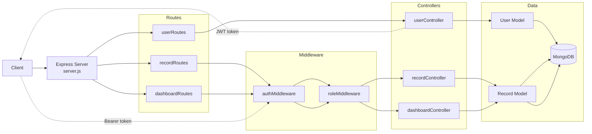

# Finance Backend

Backend API for a finance tracking application built with Node.js, Express, MongoDB, and JWT authentication.

## Tech Stack

- Node.js
- Express
- MongoDB with Mongoose
- JWT for authentication
- bcryptjs for password hashing

## Features

- User registration and login
- Role-based access control (`viewer`, `analyst`, `admin`)
- Record management for income and expense entries
- Dashboard summary APIs for totals and category breakdowns
- Soft delete support for records

## Project Structure

```text
finance-backend/
|-- config/
|-- controllers/
|-- middleware/
|-- models/
|-- routes/
|-- req.http
|-- server.js
`-- .env
```

## Architecture Diagram



Brief flow:

- Client requests enter `server.js`, which mounts the route modules.
- Public user routes go directly to `userController`.
- Protected record and dashboard routes pass through `authMiddleware` first.
- Role-based checks happen in `roleMiddleware` before hitting protected controllers.
- Controllers use Mongoose models to read and write data in MongoDB.
- Login returns a JWT token that clients send back in the `Authorization` header.

## Environment Variables

Create a `.env` file with:

```env
PORT=5000
MONGO_URI=your_mongodb_connection_string
JWT_SECRET=your_jwt_secret
```

## Installation

```bash
npm install
```

## Run The Server

Development:

```bash
npm run dev
```

Production:

```bash
npm start
```

Base URL:

```text
http://localhost:5000
```

## Authentication

- Protected routes expect `Authorization: Bearer <token>`.
- Tokens are issued from `POST /api/users/login`.
- The token payload contains the user id and role.
- Route access is controlled through `authMiddleware` and `authorizeRoles(...)`.

## Roles

- `viewer`: default user role when no role is provided at signup
- `analyst`: can access dashboard summary endpoints
- `admin`: can access dashboard endpoints and create/update/delete records

## API Routes

### Health Route

| Method | Endpoint | Access | Description | Response |
|---|---|---|---|---|
| `GET` | `/` | Public | Server health check | Plain text: `Server is running` |

---

### User Routes

| Method | Endpoint | Access | Description | Success Response |
|---|---|---|---|---|
| `GET` | `/api/users` | Public | Fetch all users | `200` with `users` array |
| `POST` | `/api/users` | Public | Create a new user account | `201` with created `user` |
| `POST` | `/api/users/login` | Public | Login and receive JWT token | `200` with `token` |

**Request body details**

| Endpoint | Required Fields | Optional Fields | Notes |
|---|---|---|---|
| `POST /api/users` | `name`, `email`, `password` | `role` | Password is hashed before save; duplicate emails return `400` |
| `POST /api/users/login` | `email`, `password` | None | Returns JWT valid for `1d`; invalid credentials return `400` |

---

### Record Routes

| Method | Endpoint | Access | Role | Description | Success Response |
|---|---|---|---|---|---|
| `GET` | `/api/records` | Public | None | List records with filters and pagination | `200` with `records`, `page`, `limit` |
| `POST` | `/api/records` | Bearer Token | `admin` | Create a finance record for the authenticated user | `201` with created `record` |
| `PUT` | `/api/records/:id` | Bearer Token | `admin` | Update an existing record | `200` with updated `record` |
| `DELETE` | `/api/records/:id` | Bearer Token | `admin` | Soft-delete a record by setting `isDeleted=true` | `200` with success `message` |

**Query parameters for `GET /api/records`**

| Param | Type | Default | Description |
|---|---|---|---|
| `user` | string | None | Filter by user id |
| `type` | string | None | Filter by `income` or `expense` |
| `category` | string | None | Filter by category |
| `page` | number | `1` | Pagination page number |
| `limit` | number | `5` | Records per page |

**Request body details**

| Endpoint | Required Fields | Optional Fields | Notes |
|---|---|---|---|
| `POST /api/records` | `amount`, `type`, `category` | `date`, `note` | Uses `req.user.id` as the record owner |
| `PUT /api/records/:id` | None | Any updatable record field | Returns `404` if record is not found |

---

### Dashboard Routes

| Method | Endpoint | Access | Role | Description | Success Response |
|---|---|---|---|---|---|
| `GET` | `/api/dashboard/summary` | Bearer Token | `admin`, `analyst` | Get total income, expense, and balance | `200` with `income`, `expense`, `balance` |
| `GET` | `/api/dashboard/categories` | Bearer Token | `admin`, `analyst` | Get category-wise totals | `200` with `categories` array |

**Query parameters**

| Endpoint | Param | Type | Description |
|---|---|---|---|
| `/api/dashboard/summary` | `user` | string | Optional user id filter |
| `/api/dashboard/categories` | `user` | string | Optional user id filter |

---

## Testing The API

The repository already includes [`req.http`](/d:/finance-backend/req.http), which contains ready-to-run HTTP requests for:

- user registration
- login
- record CRUD operations
- dashboard summary endpoints
- health check

## Current Behavior Notes

- `GET /api/users` is public.
- `GET /api/records` is also public, while create/update/delete are admin-only.
- Dashboard aggregations do not currently filter out soft-deleted records.
- Auth middleware logs the authorization header and auth errors to the console.

## Scripts

```json
{
  "start": "node server.js",
  "dev": "nodemon server.js"
}
```
